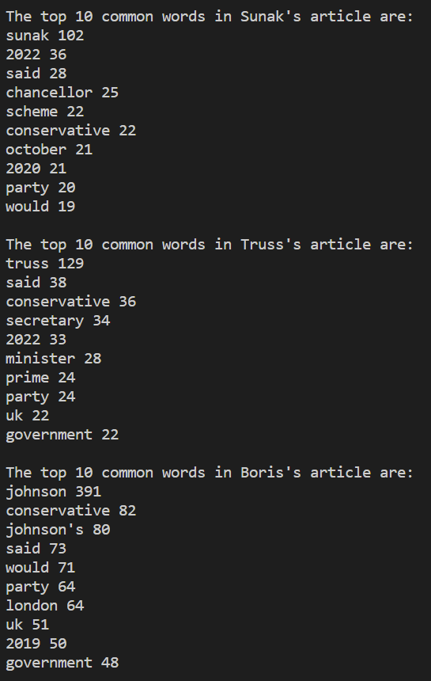

# **Project Overview** 
For this assignment, I extracted text data from wikipedia pages of the 3 recent British Prime ministers: Boris Johnson, Liz Truss and Rishi Sunak. The current political turmoil in Britain mostly started since its decision to leave the EU (Brexit) and has continued to affect the daily life of the British people ever since. The short-lived Prime minsiterial term of Liz Truss added to the drama. As such, I thought it would be interesting to analyze how the online community views these personalities. Analyzing the wikipedia articles, which are a result of open-sourced contribution from thousnads of editors, I believed a better sense of the political scenario could be understod because these individuals were/ are at the helm of the British Political institution. My objective in running these analysis were to separate the individual from the institution and see if their information had any bearing on their political actions and thoughts. I also wanted to see if the wikipedia article showed any particular bias or public viewpoint towards these individuals. I also wanted to compare the three individuals and see what common words or separate words were being used to describe them.

# **Implementation**
I started by extracting the wikipedia pages using the 'mediawiki' library. Through trial and error I found out that the extracted content was of type <\wikimedia file> but behaved as a string. So I used string methods to clean the text of punctuations and whitespaces, characters that would not add to my analysis. Then, I converted the string to list of words to make it easier to map words to frequencies which would then make it easier for calculating summary statistics. I created a dictionary of words mapping their frequencies to better process the data and run analyses in an easier manner. An instance of the histogram is here:

 

The program starts with calculating basic summary statistics which helps to get a general overlook of the data. Then the program advances a small step to calculate most repeated words in the article, which can be analysed to get a general idea of what is being most talked about regarding the individuals. In calcuating common words, I modified the code to avoid some stopwords (that, they, the, etc.) which are used frequently in the english lanagauge and would not add anything significant to our analysis. I used the 'stopwords' list from the nltk package for this purpose. Further, the program also computes the most common words between the three articles which will help give additional insight and context to the text being analyzed. 

The program then moves on to more advanced text analysis using imported python librarires. The two advanced text analysis run in this module are the sentiment analysis and the fuzz similarity analysis. The sentiment analysis gives a metric of the general mood of the text sequence and is more relevant to describing the meaning and context of the text sequence. The similarity analysis, on the other hand, uses Levenshtein distance to calculate similarity between two text sequences. Here the measurement is more focused on the words and letters being used and less on the context or meaning of the text sequence. 

All the data processing and analysis is divided into several user-defined functions within the module so that the program can be used to run similar analyses on a wider range of data extracted from wikipedia pages. The if \__name__ == '\__main__'  idiom is used to make the module importable into other programs.

# **Results**
Our analysis of the thre recent British Prime Ministers' wikipedia articles yielded somewhat expected but interesting results.

Starting with the basic summary statistics (presented below:)

We can observe that Boris Johnson's article had the most words, followed by Rishi Sunak and then Liz Truss. This is somewhat expected as Mr. Johnson has been in politics for longer than the other two individuals, and as of today held the prime ministerial position for the longest period compared to the other two. As a result, it can be assumed that he has had a wider portfolio of roles and acheivements that have been discussed in the article. The total number of different words only work to reinforce this fair assumption. 

The most common words in each individual articles as well as between the three articles also gives us some insight about what they do or what they are mostly tied to. 

As we can see, words like 'government', 'conservative', 'party', 'UK', are most common in all three individual articles. This is expected as all three are conservative politicians and most information related to them, and which is relevant for their wikipedia pages, would be about their political life and positions. The words 'said' and 'would' also appear a lot which I connected with the fact that as politicians what they do and what they say is closed watched by the public and as such their sayings and doings are expectedly relevant for their wikipedia pages. The names of the other two individuals are also quite repeated in each individual's article, which suggests that they are often compared with one another which is common for politicians, especially those who have held as prominent a position as the Prime Minister of Britain.

The sentiment analysis of the wikipedia articles gives a somewhat confusing picture:

All three articles are mostly in the neutral side, which may be interpreted as wikipedia's and generally any media source's affinity towards imparitality especially in politics. One thing that stood out to me was the Boris Johnson's positivity was on the lower side and more closer to the negativity score, compared to his two counterparts. It might be relfective of the rather controversial image that he enjoys which also resulted in a rather controversial time for him as a prime minister.

The fuzz similarity ratio between the three articles were quite low which was quite shocking to me, because I expected all three politicians with similar backgorund to be described in similar ways. This result might have been distorted due to the difference in length between the three articles, but I do not have enough information on Levenshtein distance yet to make a definite conclusion.

# **Reflection**

This was a fun project experience because it was not like other assignments or quizzes where you directly jump into coding. Here I had to give thought to what was interesting to me and also be mindful of my abilties to extract the information I need and write appropriate code to process it. I believe for the level of analysis I chose the project went well, but I would have loved to perform some more higher level analysis on a larger set of data. I guess that could be something I can pursue as an individual project to improve my coding. I got to learn about a lot of new text analysis methods and although I found some of them too confusing or complicated to apply for this project, I would love to learn more about them and use them in the future. In terms of testing and applying my code, I believe I did a good job because most of this required less coding and more managing the code and the different type of anlayses that I wanted to conduct. Overall, I greatly enjoyed this project and I think it significantly boosted my confidence in terms of coding and pursuing my own independent projects.